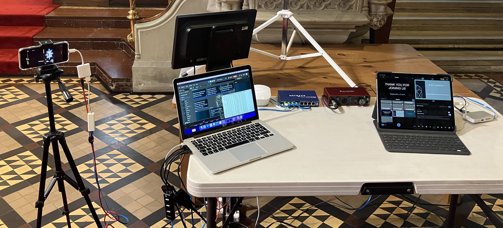
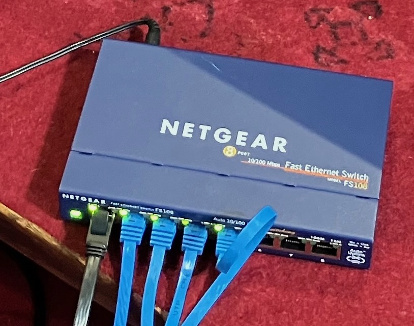
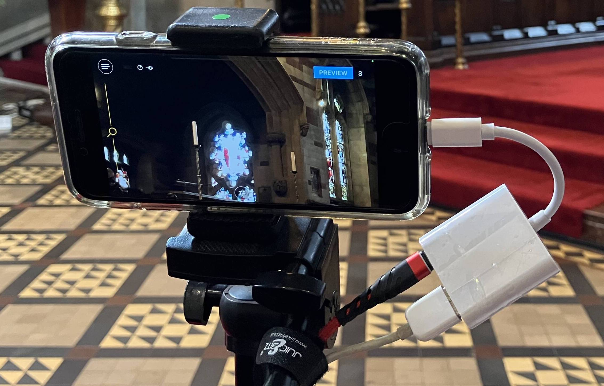
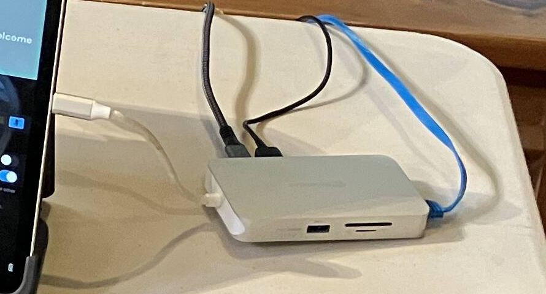

---
# YAML metadata
title: "Setup for St Bartholomew's YouTube casting"
author: "Matthew Brett"
date: "26 February 2023"
linkcolor: blue
urlcolor: blue
---

## Background

We have four computer-like things:

* An [iPad Pro (12.9 inch) (4th
  generation)](https://support.apple.com/kb/SP815) with a keyboard (IPAD).
* A [Early 2015 vintage MacBook
  Pro](https://support.apple.com/kb/SP715?locale=en_GB) (MACBOOK).  It has
  2 mini-DVI / Thunderbolt ports and two USB-A USB-3 ports.
* An iPhone 12 (IPHONE 12).
* An iPhone 8 (IPHONE 8).

Call these four — the COMPUTERISHES.

The church has WiFi via a Mesh network carried by several Eero Wifi nodes
- call these NODEs.

We run the YouTube casting in the following way:

* The IPAD runs [Switcher Studio](https://www.switcherstudio.com/).  This is an
  application from which you can accept and *switch* between video input from
  various sources, to create a live stream.
* The IPAD sends this stream output to YouTube Studio, running from the Safari
  browser on the MACBOOK.  YouTube then transmits this as a live stream to the
  internet via a NODE.
* The IPAD also saves the stream to its local disk storage, for later editing
  or upload.

We use the MACBOOK to display lyrics for songs, liturgy and slides to the
following physical devices in the church:

* A projector, projecting to a screen in front of the pulpit, for the
  congregation.
* A small monitor, pointing towards the chancel, for the clergy to see what the
  rest of us are seeing on the projector screen.

We use the [Proclaim application](https://faithlife.com/products/proclaim) to
control the outputs to the projector and the clergy monitor.

We also use the Switcher Cast Mac application to pass these outputs to Switcher
Studio on the IPAD, via the network.

Call this output — the PROCLAIM OUTPUT.

The Switcher Studio application runs on the IPAD. It receives the following
inputs:

* Sound input from an external USB sound card — in fact a [Focusrite Scarlett
  2i2](https://focusrite.com/en/usb-audio-interface/scarlett/scarlett-2i2).
  Call this USB SOUND.

  

* Video camera input via the network from the IPHONE 12.
* Video camera input via the network from the IPHONE 8.
* Video screen input via the network from the MACBOOK PROCLAIM OUTPUT.

In order for Switcher Studio (on the IPAD) to get the video inputs, each of the
IPHONE 12, IPHONE 8 and the MACBOOK run the Switcher Cast application.

For the two IPHONES, we use the *Switcher Cast* application to transmit the
*camera* video output.

For the MACBOOK, we use Switcher Cast to transit the PROCLAIM OUTPUT.

### Two options for networking

There are two options for networking in this setup:

1. Fully wireless — WIFI
2. Fully wired  — WIRED

The following picture is the whole setup, except the IPHONE 12 and projector,
using the WIRED configuration.

.

#### WIFI

All COMPUTERISHES join the "StBartholomewPrivate" Wifi network, carried by the
NODEs.

All network traffic between COMPUTERISHES therefore goes through the nearest Wifi NODE.

This is a _lot_ of network traffic carried on Wifi via the NODE, because we
have:

1. HD camera IPHONE 12 via Switcher Cast to IPAD.
2. HD camera IPHONE 8 via Switcher Cast to IPAD.
3. High resolution PROCLAIM OUTPUT from MACBOOK via Switcher Cast to IPAD.
4. Output video stream from IPAD to MACBOOK
5. YouTube stream from MACBOOK to internet.

As a result, when running this way, you will see many dropped packets and some
freezing on the IPAD Switcher Studio interface, and considerable delay between
the PROCLAIM OUTPUT and the IPAD Switcher Studio view of that output.

It's not clear whether this results in freezing in the YouTube stream.

#### WIRED

All traffic between the COMPUTERISHES and to the NODE goes via a wired
Ethernet connection, greatly reducing the WiFi traffic going to and from the
NODE.

Our current setup is this:

* All COMPUTERISHES connect to an ETHERNET SWITCH via Ethernet cables.  The
  ETHERNET SWITCH connects to the NODE, and therefore to the rest of the church
  network and the internet, via an Ethernet cable to the NODE.

  

With that setup, all camera and video traffic goes via wired connections.

In what follows, we distinguish steps for the two options: WIFI, and WIRED.

## Setup procedure

* Get small black tripod and church sound cable with 3.5mm jack from behind and
  to the right of the pulpit (right when facing towards the chancel).
* Make sure the 4-plug extension cord is plugged into the socket at the aisle
  end of the front pew.
* Make sure the socket is turned on, confirm the extension lead has power
  lights on.
* Plug the 6-plug EXTENSION BLOCK into the 4-plug extension lead.  You'll be
  plugging most of the equipment into the 6-plug extension block.

### Extra network setup if WIRED network

If a Eero NODE is not already plugged into the power extension cord under the
front pew, go find one; there may be one plugged into the power for the sound
desk next to the organ pipes. Unplug the NODE, and plug it into to the
EXTENSION BLOCK.  Wait for the light on the NODE to stop flashing, at which
point it is connected to the Mesh network.

Plug the ETHERNET SWITCH power supply into the EXTENSION BLOCK.  Connect the
ETHERNET SWITCH and the NODE with an Ethernet cable (maybe the 2 metre red
Ethernet cable).

The colour of the Ethernet cable tells you its length:

* 10cm : white
* 2 metres : red
* 3 metres : blue
* 6 metres : yellow

### Projector

* Put projector on table.
* It should be directly in front of the screen, because the projector has no
  horizontal keystone settings.  You'll find this means the projector should be
  about half way between the aisle edge of the pew and the pillar.
* Plug VGA cable into projector.
* Plug power cable into projector.
* Connect power cable plug to extension power.
* Turn on projector to let it warm up.

See below for the section on *adjusting the projector*, when it has warmed up,
and it has display signal coming from the MACBOOK.

### Clergy monitor

* Put on table next to projector screen.  Adjust angle so someone can read it
  from the top of the steps in the chancel.
* Plug power into EXTENSION BLOCK.

### For both IPHONE 12 and IPHONE 8

* Turn on phone.  Log in with PIN in blue book.
* You will need the red 3 metre lightning to USB cable for the IPHONE 8.  Use
  the green 5 metre lighting to USB cable for the IPHONE 12.
* If WIFI:
    * _Turn on the phone WiFi_.  Connect to StBartholomewPrivate.
    * Plug lightning to USB-A cable from phone into USB-A power somewhere; the
      USB-A power sockets on the EXTENSION BLOCK are convenient.
* If WIRED:
    * _Turn off the phone WiFi_.
    * Plug lightning to USB-A / lightning power adapter (L2USB) into phone.
    * Plug USB-A to Ethernet connector into the L2USB connector.

      

    * Plug lightning to USB-A cable into L2USB connector, and into USB-A power
      somewhere; the USB-A power sockets on the EXTENSION BLOCK are convenient.
    * Connect Ethernet cable between the Ethernet connector and the ETHERNET
      SWITCH; blue 3 meter cable for IPHONE 8, yellow 6 meter cable for IPHONE
      12.

### MACBOOK

* Turn on MACBOOK, log in as St Bartholomew's, password in blue book.
* Plug power adapter into EXTENSION BLOCK, connect other end of power cable
  (magsafe) to MACBOOK.
* If WIFI:
    * Turn on WiFi.
    * Connect WiFi to StBartholomewsPrivate
* If WIRED:
    * _Turn off Wifi_.
    * Plug in USB-A to 3 x USB-A / Ethernet hub (USB-A HUB).

      

    * Connect USB-A HUB to the ETHERNET SWITCH with an Ethernet cable.

* Plug both mini-DVI to VGA adapters into mini-DVI / Thunderbolt ports.
* Plug clergy monitor VGA cable into VGA adapter nearer the back of the laptop.
* Plug projector VGA cable into the other VGA adapter.
* We have set up the configured displays to be:
    1.  The laptop retina display.
    2.  The projector and clergy monitors as one combined external display.

  Here's what that setup looks like in System Preferences -> Displays:

  

  Specifically, in System Settings -> Displays, we have set the laptop display
  to be one display, and then set the projector to *mirror* the clergy display,
  so they form a single display.

See the end of the document for display troubleshooting.

### USB SOUND

* Connect 3.5mm church sound headphone jack to left input.
* Plug USB-C to USB-A cable into USB-C socket at the back of the box.  You will
  soon connect the USB-A end to the USB-C hub connected to the IPAD (see
  below).

### IPAD

* Turn on IPAD.
* PIN to log in is in small blue book.
* Connect USB-C hub (USB-C HUB).

* Plug USB-C power adapter plug into EXTENSION BLOCK.  Plug USB-C to USB-C
  cable into power adapter and into USB-C HUB.
* Connect USB SOUND to USB-C HUB via USB-C to USB-A cable.
* If WIFI:
    * Go to System Preferences, _turn on WiFi_.
* If WIRED:
    * Go to System Preferences on IPAD, _turn off WiFi_.
    * Plug Ethernet cable into USB-C HUB.
    * Plug other end of the Ethernet cable into the ETHERNET SWITCH.
* Start Switcher Studio application.  You should not need to log in, but if you
  do have to log in, see username and password in the blue book.
* Go to Switcher Studio sound settings by selecting sound icon from panel at
  bottom right.

  

* Configure USB sound to Mono Left Channel.  Confirm that sound
  monitor bar at top of screen shows sound for left and right channels.
* Connect Bluetooth headphones by turning them on.  Monitor sound level.
  Adjust level with left hand input level volume control on USB sound box.

### To reset WIRED network

*If the wired network is not working*:

1. Check that WiFi is _off_ for all COMPUTERISHES.
2. Check that all COMPUTERISHES have Ethernet cable connections to the ETHERNET
   SWITCH.
3. Check that there is a connection from the ETHERNET SWITCH to the MESH NODE.
4. Check that there is a green light on the ETHERNET SWITCH corresponding to
   each COMPUTERISH Ethernet connection, and the NODE Ethernet connection. This
   tells you that the cable is carrying a live Ethernet connection.
5. Unplug the power to the ETHERNET SWITCH. Wait a few seconds.  Plug the power
   back in again. This should reset the IP addresses for all the COMPUTERISHES.

### Proclaim setup

* Go the MACBOOK
* Open Proclaim application
* Go to File -> Open

  

* Select the Proclaim setup file for today's service, and open it.  If it does
  not exist, run and find the clergy to ask — but we, your humble authors, have
  never had that problem.

  

* Once open, switch Proclaim from Edit mode, to On Air, by clicking the "On
  Air" button. The causes the Proclaim output to go out to the projector and
  clergy monitor.

  

  

* Take the opportunity to check that the Proclaim file input is properly
  synchronized with the latest version in the cloud.  There should be a green
  check mark next to the On Air button:

  

  If not, please click on the icon and ask Proclaim to sync.

* Run Switcher Cast on the MACBOOK.

You are now ready to accept the PROCLAIM OUTPUT to Switcher Studio on the IPAD.

### Switcher Studio and camera setup

* Make sure Switcher Studio application is running on the IPAD.
* Go to Audio settings by selecting the audio icon from the line at the bottom
  left of the interface:

  

* Look at the USB Audio Input panel, and check sound is coming through on
  left monitor bar:

  

* Select the Settings icon for the USB Audio Input panel, and select Left to
  Mono, confirm, to make the left channel go to both channels.
* Look at the output sound monitoring panel at the top of the interface to
  confirm that sound is now coming through on both channels:

  

* Go to the video input panel by selecting the video icon from line at the
  bottom right of the interface.

  

* Disable the IPAD camera by unchecking the "Built-in Camera".
* Enable PROCLAIM OUTPUT. Making sure that Switcher Cast is running on the
  MACBOOK, and that Proclaim is "On Air" (see above).  In Switcher Studio on
  the IPAD, you should see "Display 1 on Saint's Macbook Pro" and "Display
  2 on Saint's Macbook Pro".  Enable Display 2.  Go the Switcher Cast on the
  MACBOOK and accept the connection. You should see the PROCLAIM OUTPUT
  appearing in various preview panels on the left of the Switcher Studio
  interface.  **Note** — if you get a spinning icon on Switcher Studio for
  Display 2, and fail to connect, and you are using WIRED connections, check
  that the WiFi is off on the MACBOOK.  If it was on, turn it off, and restart
  Switcher Studio on the IPAD.  You'll have to go back and reconfigure the
  sound using the steps above, if you had to restart Switcher Studio.
* Follow the next set of steps for both the IPHONE 12 and IPHONE 8:
    * If WIFI:
        * Confirm that iPhone WiFi is on, and you are connected to
          the "StBartholomewPrivate" WiFi network.
    * If WIRED:
        * Confirm that WiFi is off, the Ethernet cable is connected, and the
          corresponding cable has a green light on the ETHERNET SWITCH,
          indicating a live connection.
    * Run Switcher Cast on iPhone, select "SHARE THIS DEVICE", then "SHARE THIS CAMERA".
    * Go to IPAD Switcher Interface, and select "StBiPhone12" (IPHONE 12) or
      "StBiPhone8" (IPHONE 8).  Wave your hand in front of the iPhone camera to
      confirm you can see the live camera output in the Switcher Studio
      interface.

  

* Move silver tripod to aisle end of pew.  Mount IPHONE 12, and adjust for good
  view of the chancel, with the left hand view just taking in the lectern, so
  we can see the readings if necessary from this camera.
* Pull out legs and extend central column of the small black tripod, put in
  front of front pew next to the equipment table.  Mount IPHONE 8.  Adjust so
  the camera has a good view of the musicians and the lectern.
* Select main chancel view to be current on Switcher Studio.
* Click on appropriate "Welcome to" message as overlay.

  

* Tee up next view in preview panel of switcher - typically the main chancel
  view with a text panel.

You probably won't need to futz with the Switcher *stream configuration*, but
if you do, see the Appendix.

### YouTube stream setup

* Go to IPAD.  Make sure your current view in Switcher is the one you want to
  start with the Welcome panel.
* Open Safari on MACBOOK
* Open YouTube in Safari.
* If you are not already in YouTube studio, click the Create button and then
  select "Go Live".

  

* Click on the Manage button on the left, and open scheduled upcoming live
  stream session for this service.  There should be one available.  If not, ask
  the clergy.
* You usually don't need to change the stream settings, but see the appendix at
  the end for a screenshot, in case you do.
* Plan to start the live stream 15 minutes before the service.

### Starting the YouTube stream

* Go to IPAD, Switcher Studio.  Click on red button at top left, to start
  recording and live stream.

  

* Go back to the MACBOOK YouTube interface. When the stream becomes available,
  click Go Live.

### Adjust projector

* Make sure the projector is straight in front of the screen.
* You will need a small book, such as the Book of Common Prayer, to rest the
  front projector leg on.
* Adjust the front projector leg and the right rear projector leg to get the
  image straight on the screen.  Adjust zoom to taste, and focus.
* If you have the projector straight in front of the screen you should not need
  to adjust the vertical keystone.  It seems to be about right when more or
  less in the centre of its range.
* You may need to move the projector left and right a bit to get the horizontal
  keystone right. If that doesn't correct the keystone, you can try rotating
  the projector screen a little.

### Check text in Proclaim

* Get service sheet and hymn book.
* Go through Proclaim slides checking words from listed hymns and printed
  choruses.
* Check with clergy about missing verses, and with musicians about any
  not-printed repeats to chorus verses.

### Pre-flight checks

* Do a final check to make sure the Proclaim output is synchronized — you should
  see the green check mark next to the On Air button — see above:

  

### Service starts

* On IPAD, Switcher Studio — turn off welcome panel.
* Enjoy the ride.

### Service ends

* When clergy have gone out of shot, after a little while, turn on Thank You
  panel.
* When organ voluntary has finished, switch to end video.  Go to the USB Audio
  Input panel and click Mute to turn off the live sound from the church:

  

* Turn off projector.
* When end video done, turn off stream with red button to top left of Switcher
  Studio interface on IPAD.
* Go to YouTube interface on Safari, on the MACBOOK, and turn off live stream.

## Appendices

### Miscellaneous settings

### Full list of physical connections

If WIRED - Ethernet cable from NODE to ETHERNET SWITCH.

* MACBOOK:
    * Magsafe power.
    * mini-DVI to VGA to clergy monitor.
    * mini-DVI to VGA to projector.
    * If WIRED:
        * USB-A to USB-A HUB.
        * Ethernet from USB-A HUB to ETHERNET SWITCH.
* IPAD:
    * USB-C HUB:
        * USB-A to external USB SOUND
        * USB-C to USB-C power adapter
        * If WIRED:
            * Ethernet cable from USB-C HUB to ETHERNET SWITCH.
* IPHONE 8 and IPHONE 12:
    * If WIFI:
        * Lightning to USB-A power on extension block.
    * If WIRED:
        * L2USB adapter plugged into lightning port.
        * USB to Ethernet adapter plugged into L2USB adapter.
        * Ethernet cable from USB to Ethernet adaptor to ETHERNET SWITCH.
        * L2USB lightning input to USB-A power on extension block.

## Troubleshooting

### MACBOOK Display troubleshooting

1. Make sure Proclaim is running and in "On Air" mode.
2. Close the Switcher Cast application on the MACBOOK.
3. Unplug both DVI connectors from the MACBOOK.  Wait a few seconds.  Plug them
   back in again.
4. Check you can see the PROCLAIM OUTPUT on both the projector and the clergy
   monitor.   If not, check the System Settings -> Displays setup, as above.
   Unplug and replug the DVI cables again.
5. When the displays are giving the right output, start Switcher Cast again, go
   to the IPAD, and connect Switcher Studio to the MACBOOK display output
   again.

### Stream errors

We have been seeing a large number of streaming errors of form
"Broadcasting communication error: Transmission failed".  See the [Broadcast
Error
Messages](https://support.switcherstudio.com/article/371-broadcasting-error-messages)
page for Switcher Studio.  The errors are caused by insufficient upload speed
via the network.   This might be because of problems communicating with the
router, via the WiFi network, or our broadband upload speed could be too low.
We're investigating using
a [Powerline](https://www.cable.co.uk/broadband/guides/powerline-networking/)
wired connection to the router, to eliminate problems in the WiFi, but we may
need to drop the live stream quality, and / or investigate our broadband upload
speeds.
