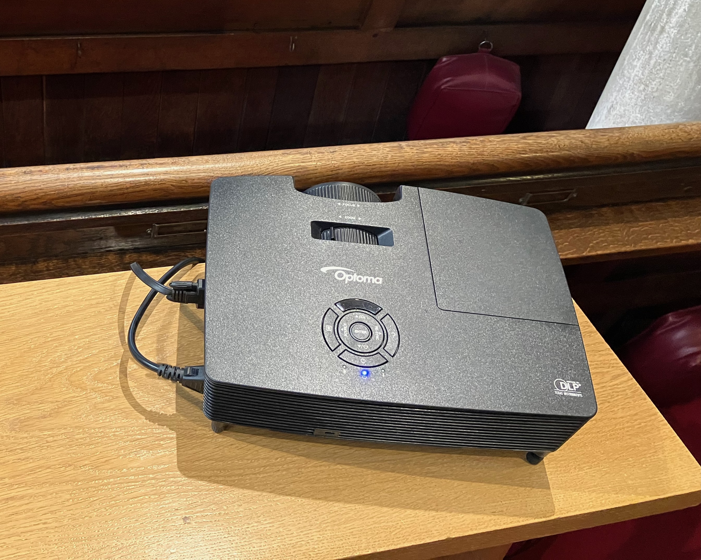
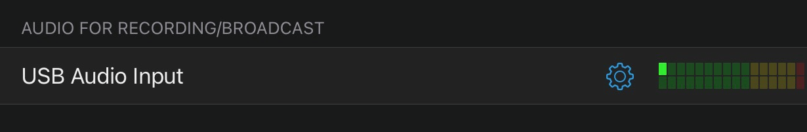
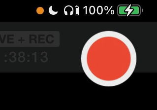

---
# YAML metadata
title: "Setup for St Bartholomew's YouTube casting"
author: "Matthew Brett"
date: "26 February 2023"
linkcolor: blue
urlcolor: blue
---

## Background

We have four computer-like things:

* An [iPad Pro (12.9 inch) (4th
  generation)](https://support.apple.com/kb/SP815) with a keyboard (IPAD).
* A [Early 2015 vintage MacBook
  Pro](https://support.apple.com/kb/SP715?locale=en_GB) (MACBOOK).  It has
  2 mini-DVI / Thunderbolt ports and two USB-A USB-3 ports.
* An iPhone 12 (IPHONE 12).
* An iPhone 8 (IPHONE 8).

Call these four — the COMPUTERISHES.

The church has WiFi via a Mesh network carried by several Eero Wifi nodes
- call these NODEs.

We run the YouTube casting in the following way:

* The IPAD runs [Switcher Studio](https://www.switcherstudio.com/).  This is an
  application from which you can accept and *switch* between video input from
  various sources, to create a live stream.
* The IPAD sends this stream output to YouTube Studio, running from the Safari
  browser on the MACBOOK.  YouTube then transmits this as a live stream to the
  internet via a NODE.
* The IPAD also saves the stream to its local disk storage, for later use.

We use the MACBOOK to display lyrics for songs, liturgy and slides to the
following physical devices in the church:

* A projector, projecting to a screen in front of the pulpit, for the
  congregation.
* A small monitor, pointing towards the chancel, for the clergy to see what the
  rest of us are seeing on the projector screen.

We use the [Proclaim application](https://faithlife.com/products/proclaim) to
control the outputs to the projector and the clergy monitor.

We also use Switcher to pass these outputs to Switcher Studio on the IPAD, via
the network.

Call this output — the PROCLAIM OUTPUT.

The Switcher Studio application runs on the IPAD. It receives the following
inputs:

* Sound input from an external USB sound card — in fact a [Focusrite Scarlett
  2i2](https://focusrite.com/en/usb-audio-interface/scarlett/scarlett-2i2).
  Call this USB SOUND.
* Video camera input via the network from the IPHONE 12.
* Video camera input via the network from the IPHONE 8.
* Video screen input via the network from the MACBOOK PROCLAIM OUTPUT.

In order for Switcher Studio (on the IPAD) to get the video inputs, each of the
IPHONE 12, IPHONE 8 and the MACBOOK run the Switcher Cast application.

For the two IPHONES, we use Switcher Cast to transmit the *camera* video
output.

For the MACBOOK, we use Switcher Cast to transit the PROCLAIM OUTPUT.

### Two options for networking

There are two options for networking in this setup:

1. Fully wireless — WIFI
2. Partly wired  — WIRED

#### WIFI

All COMPUTERISHES join the StBartholomewPrivate Wifi network, carried by the
NODEs.

All network traffic between COMPUTERISHES therefore goes through the nearest Wifi NODE.

This is a _lot_ of network traffic carried on Wifi via the NODE, because we
have:

1. HD camera IPHONE 12 via Switcher Cast to IPAD.
2. HD camera IPHONE 8 via Switcher Cast to IPAD.
3. High resolution PROCLAIM OUTPUT from MACBOOK via Switcher Cast to IPAD.
4. Output video stream from IPAD to MACBOOK
5. YouTube stream from MACBOOK to internet.

As a result, when running this way, you will see many dropped packets and some
freezing on the IPAD Switcher Studio interface, and considerable delay between
the PROCLAIM OUTPUT and the IPAD Switcher Studio view of that output.

It's not clear whether this results in freezing in the YouTube stream.

#### WIRED

Nearly all traffic between the COMPUTERISHES and to the NODE goes via a wired
Ethernet connection, greatly reducing the WiFi traffic going to and from the
NODE.

Our current setup is this:

* The IPAD and the MACBOOK connect directly to the NODE via Ethernet.
* The IPHONE 8 gets its wired network from the MACBOOK via USB using Internet
  Sharing.
* The IPHONE 12 connects via WiFi to the NODE.

With that setup, all camera, video and internet traffic for the IPAD, MACBOOK
and IPHONE 8 goes via wired connections.  In practice the IPHONE 12 connection
via Wifi is stable in this situation, especially so, because you have taken away
most of the Wifi network load with the wired connections. You should see no
dropped packets or freezing on the IPAD Switcher Studio interface.

In what follows, we distinguish steps for the two options: WIFI, and WIRED.

## Setup procedure

* Get small black tripod and church sound cable with 3.5mm jack from behind and
  to the right of the pulpit (right when facing towards the chancel).
* Plug extension cord into socket at the aisle end of the front pew.
* Turn on the socket, confirm the extension block has power lights on.

### Extra network setup if WIRED network

If a Eero NODE is not already plugged in to the power extension block under the
front pew, go find one, unplug it, and plug it into to our power extension
block.  Wait for the light on the NODE to stop flashing, at which point it is
connected to the Mesh network.

### Projector

* Put projector on table.
* It should be directly in front of the screen, because the projector has no
  horizontal keystone settings.  You'll find this means the projector should be
  about half way between the aisle edge of the pew and the pillar.
* Plug VGA cable into projector.
* Plug power cable into projector.
* Connect power cable plug to extension power.
* Turn on projector to let it warm up.

### Clergy monitor

* Put on table next to projector screen.  Adjust angle so someone can read it
  from the top of the steps in the chancel.
* Plug power into extension block.

### IPHONE 12

* Turn on phone.  Log in with PIN in blue book.
* Plug lightning to USB-A cable from phone into USB-A power on power extension
  block.
* _Turn on the phone WiFi_.  Connect to StBartholomewPrivate.

### For IPHONE 8

* Turn on phone.  Log in with PIN in blue book.
* If WIFI:
    * _Turn on the phone WiFi_.  Connect to StBartholomewPrivate.
    * Plug lightning to USB-A cable from phone into USB-A power on power
      extension block.
* If WIRED:
    * _Turn off the phone WiFi_.
    * Plug lightning to USB-A cable from phone into USB-A port on MACBOOK.

### MACBOOK

* Turn on MACBOOK, log in as St Bartholomew's, password in blue book.
* Plug power adapter into extension block, connect other end of power cable
  (magsafe) to MACBOOK.
* If WIFI:
    * Turn on WiFi.
    * Connect WiFi to StBartholomewsPrivate
* If WIRED:
    * Turn off Wifi.
    * Plug in USB-A to 3 x USB-A / Ethernet hub (USB-A HUB).
    * You should already have attached the IPHONE 8 to a MACBOOK USB-A port
      (see above).  If you haven't done that, do it now — any USB-A port will
      do - direct to the MACBOOK or on the USB-A HUB.
    * Connect USB-A HUB to the NODE with an Ethernet cable.
    * Go to System Preferences -> Sharing.  Internet sharing options should be
      set to "Share your internet connection from:" — USB 10/100/1000 — "To
      computers using:" — iPhone USB.  Enable internet sharing.

* Plug both mini-DVI to VGA adapters into mini-DVI / Thunderbolt ports.
* Plug clergy monitor VGA cable into rear VGA adapter.
* Plug projector VGA cable into front VGA adapter.
* We have set up the configured displays to be:
    1.  The laptop retina display.
    2.  The projector and clergy monitors as one combined external display.

### USB SOUND

* Connect 3.5mm church sound headphone jack to left input.
* Plug USB-C to USB-A cable into USB-C socket at the back of the box.

### IPAD

* Turn on IPAD.
* PIN to log in is in small blue book.
* Connect USB-C hub (USB-C HUB).

* Plug USB-C power adapter into extension block.  Plug USB-C to USB-C cable
  into power adapter and into USB-C HUB.
* Connect external USB SOUND to USB-C HUB via USB-C to USB-A cable.
* If WIFI:
    * Go to System Preferences, _turn on WiFi_.
* If WIRED:
    * Go to System Preferences on IPAD, _turn off WiFi_.
    * Plug USB-A to Ethernet adapter into USB-C HUB.
    * Plug Ethernet cable into Ethernet adapter.
    * Plug other end of the Ethernet cable into the NODE.
* Start Switcher Studio application.  You should not need to log in, but if you
  do have to log in, see username and password in the blue book.
* Go to Switcher Studio sound settings by selecting sound icon from panel at
  bottom right.  Configure USB sound to Mono Left Channel.  Confirm that sound
  monitor bar at top of screen shows sound for left and right channels.
* Connect Bluetooth headphones.  Monitor sound level.  Adjust level with left
  hand input level volume control on USB sound box.

### To reset WIRED network

*If the wired network is not working*, unplug the Ethernet cables to the NODE.
Wait a few seconds.  Plug them back in again. This should reset the IP
addresses for the MACBOOK and the IPAD.

If the USB network connection for the IPHONE 8 is not working, try turning off
Internet sharing on the MACBOOK, and turning it back on again.

### Proclaim setup

* Go the MACBOOK
* Open Proclaim application
* Go to File -> Open

* Select the Proclaim setup file for today's service, and open it.  If it does
  not exist, run and find the clergy to ask — but we, your humble authors, have
  never had that problem.

* Once open, switch Proclaim from Edit mode, to On Air, by clicking the "On
  Air" button. The causes the Proclaim output to go out to the projector and
  clergy monitor.

* Run Switcher Cast on the MACBOOK, and make sure you have enabled the "Accept
  requests automatically" toggle at the bottom of the Switcher Cast interface.

You are now ready to accept the PROCLAIM OUTPUT to Switcher Studio on the IPAD.

### Switcher Studio and camera setup

* Make sure Switcher Studio application is running on the IPAD.
* Go to Audio settings by selecting the audio icon from the line at the bottom
  left of the interface:

* Look at the USB Audio Input panel, and check sound is coming through on
  left monitor bar:

* Select the Settings icon for the USB Audio Input panel, and select Left to
  Mono, confirm, to make the left channel go to both channels.
* Look at the output sound monitoring panel at the top of the interface to
  confirm that sound is now coming through on both channels:

* Go to the video input panel by selecting the video icon from line at the
  bottom right of the interface.

* Disable the IPAD camera by unchecking the "Built-in Camera".
* Enable PROCLAIM OUTPUT. Making sure that Switcher Cast is running
  on the MACBOOK, and that Proclaim is "On Air" (see above).  In Switcher
  Studio on the IPAD, you should see "Display 1 on Saint's Macbook Pro" and
  "Display 2 on Saint's Macbook Pro".  Enable Display 2.  You should see the
  PROCLAIM OUTPUT appearing in various preview panels on the left of the
  Switcher Studio interface.
* Enable IPHONE 12 — run Switcher Cast on IPHONE 12, select "SHARE THIS
  DEVICE", then "SHARE THIS CAMERA", go to IPAD Switcher Interface, and select
  "iPhone (2)".  Wave in front of the IPHONE 12 camera to confirm you can see
  the live camera output in the Switcher Studio interface.
* Enable IPHONE 8 — run Switcher Cast on IPHONE 8, select "SHARE THIS
  DEVICE", then "SHARE THIS CAMERA", go to IPAD Swicher Interface, and select
  "iPhone (229)". Wave in front of the IPHONE 8 camera to make sure it is live.

* Move silver tripod to aisle end of pew.  Mount IPHONE 12, and adjust for good
  view of the chancel, with the left hand view just taking in the lectern, so
  we can see the readings if necessary from this camera.
* Pull out legs and extend central column of the small black tripod, put in
  front of front pew next to the equipment table.  Mount IPHONE 8.  Adjust so
  the camera has a good view of the musicians and the lectern.
* Select main chancel view to be current on Switcher Studio.
* Click on appropriate "Welcome to" message as overlay.

* Tee up next view in preview panel of switcher - typically the main chancel
  view with a text panel.

You probably won't need to futz with the Switcher stream configuration, but if
you do, see the Appendix.

### YouTube stream setup

* Go to IPAD.  Make sure your current view in Switcher is the one you want to
  start with the Welcome panel.
* Open Safari on MACBOOK
* Open YouTube in Safari.
* If you are not already in YouTube studio, click the Create button and then
  select "Go Live".

* Select scheduled live stream session for service.  There should be one
  available.  If not, ask the clergy.
* You usually don't need to change the stream settings, but see the appendix at
  the end for a screenshot, in case you do.
* Plan to start the live stream 15 minutes before the service.
* Go to IPAD, Switcher Studio.  Click on red button at top left, to start
  recording and live stream.

* Go back to the MACBOOK YouTube interface. When the stream becomes available,
  click Go Live.

### Adjust projector

* Make sure the projector is straight in front of the screen.
* You will need a small book, such as the Book of Common Prayer, to rest the
  front projector leg on.
* Adjust the front projector leg and the right rear projector leg to get the
  image straight on the screen.  Adjust zoom to taste, and focus.
* If you have the projector straight in front of the screen you should not need
  to adjust the vertical keystone.  It seems to be about right when more or
  less in the centre of its range.  You may need to move the projector left and
  right a bit to get the keystone right. If that doesn't correct the keystone,
  you can try rotating the screen.

### Check text in Proclaim

* Get service sheet and hymn book.
* Go through Proclaim slides checking words from listed hymns and printed
  choruses.
* Check with clergy about missing verses, and with musicians about any
  not-printed repeats to chorus verses.

### Service starts

* On IPAD, Switcher Studio — turn off welcome panel.
* Enjoy the ride.

### Service ends

* When clergy have gone out of shot, after a little while, turn on Thank You
  panel.
* When organ voluntary has finished, switch to end video.  Go to the USB Audio
  Input panel and click Mute to turn off the ambient sound.
* Turn off projector.
* When end video done, turn off stream with red button to top left of Switcher
  Studio interface on IPAD.
* Go to YouTube interface on Safari, on the MACBOOK, and turn off live stream.

## Appendices

### Miscellaneous settings

### Full list of physical connections

* MACBOOK:
    * Magsafe power.
    * mini-DVI to VGA to clergy monitor.
    * mini-DVI to VGA to projector.
    * If WIRED:
        * USB-A to USB-A HUB.
        * Ethernet from USB-A HUB to NODE.
* IPAD:
    * USB-C HUB:
        * USB-A to USB external sound
        * USB-C to USB-C power adapter
        * If WIRED:
            * USB-A Ethernet adaptor
            * Ethernet cable from adaptor to NODE.
* IPHONE 8:
    * If WIFI:
        * Lightning to USB-A power on extension block.
    * If WIRED:
        * Lightning to USB-A on MACBOOK USB-A HUB.
* IPHONE 12:
    * Lightning to USB-A power on extension block.
