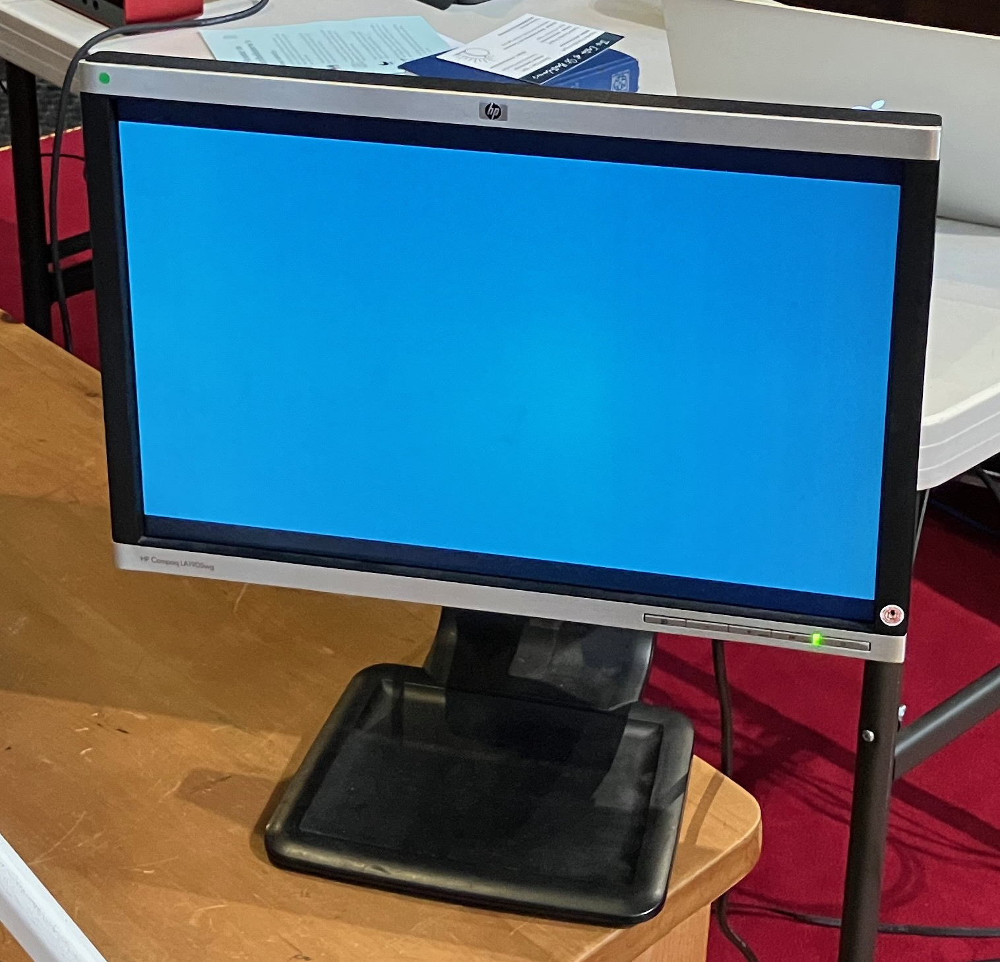
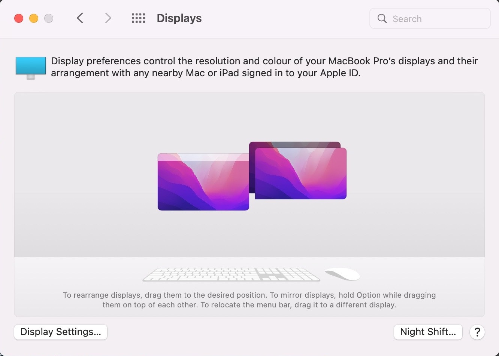

---
# YAML metadata
title: "Setup for St Bartholomew's YouTube casting"
author: "Matthew Brett"
date: "22 September 2024"
linkcolor: blue
urlcolor: blue
---

## Background

We have four computer-like things:

* An [iPad Pro (12.9 inch) (4th
  generation)](https://support.apple.com/kb/SP815) with a keyboard (IPAD).
* A [Early 2015 vintage MacBook
  Pro](https://support.apple.com/kb/SP715?locale=en_GB) (MACBOOK).  It has
  2 mini-DVI / Thunderbolt ports and two USB-A USB-3 ports.
* An iPhone 12 (IPHONE 12).
* An iPhone 8 (IPHONE 8).

The church has WiFi via a Mesh network carried by several Eero Wifi nodes
- call these NODEs.

We run the YouTube casting in the following way:

* The IPAD runs [Switcher Studio](https://www.switcherstudio.com/).  This is an
  application from which you can accept and *switch* between video input from
  various sources, to create a live stream.
* The IPAD sends this stream output to YouTube Studio, running from the Safari
  browser on the MACBOOK.  YouTube then transmits this as a live stream to the
  internet via a NODE.
* The IPAD also saves the stream to its local disk storage, for later editing
  or upload.

We use the MACBOOK to display lyrics for songs, liturgy and slides to the
following physical devices in the church:

* A projector, projecting to a screen in front of the pulpit, for the
  congregation.
* A small monitor, pointing towards the chancel, for the clergy to see what the
  rest of us are seeing on the projector screen.

We use the [Proclaim application](https://faithlife.com/products/proclaim) to
control the outputs to the projector and the clergy monitor.

We also use the Switcher Cast Mac application to pass these outputs to Switcher
Studio on the IPAD, via the network.

Call this output — the PROCLAIM OUTPUT.

The Switcher Studio application runs on the IPAD. It receives the following
inputs:

* Sound input from an external USB sound card — in fact a [Focusrite Scarlett
  2i2](https://focusrite.com/en/usb-audio-interface/scarlett/scarlett-2i2).
  Call this USB SOUND.

  

* Video camera input via the network from the IPHONE 12.
* Video camera input via the network from the IPHONE 8.
* Video screen input via the network from the MACBOOK PROCLAIM OUTPUT.

In order for Switcher Studio (on the IPAD) to get the video inputs, each of the
IPHONE 12, IPHONE 8 and the MACBOOK run the Switcher Cast application.

For the two IPHONES, we use the *Switcher Cast* application to transmit the
*camera* video output.

For the MACBOOK, we use Switcher Cast to transit the PROCLAIM OUTPUT.

## The USB-C hub

We connect devices and power to the IPAD using an Anker USB-C hub (USB-C HUB):

{height=50%}

## The setup in detail

## Networking

The basic setup is:

* IPAD connected to IPHONE 12 via USB-C HUB (giving power and data).
* IPAD connected to IPHONE 8 via USB-C HUB (power and data).
* IPAD connected to USB SOUND via USB-C HUB (power and data).
* IPAD network connection to MACBOOK via WiFi NODE.
* MACBOOK network connection to internet via WiFi NODE.

WiFi should be *off* for the IPHONE 8 and IPHONE 12 (because they are connected
for data via the USB cables).

Optionally, you can connect the IPAD and MACBOOK via an Ethernet cable, of
which more below.  Call this configuration OPTIONAL ETHERNET, and the setup without optional Ethernet — the STANDARD CONFIGURATION.

The following picture is the whole setup, except the IPHONES 8 and 12 and
projector, in the STANDARD CONFIGURATION.

.

## Setup procedure

See the appendices for setup that should already be done and waiting for you.  now to the usual setup for streaming.

* Get black tripod and church sound cable with 3.5mm jack from behind and to
  the right of the pulpit (right when facing towards the chancel).
* Open the drawer in the cabinet under the table, to find the 4-plug lead.
* Plug the 4-plug lead into the 6-plug extension block under the pew.
* Fetch the USB-C HUB from the cabinet drawer, and put it on the table ready to
  plug into the IPAD.  The USB-C HUB should already be connected to the USB
  power adapter, that, in turn, is plugged into the 4-plug extension.
* Fetch the MACBOOK end of the Macbook power adaptor cable from the cabinet,
  ready to plug into the MACBOOK.

### Projector

The projector ends of the power and VGA cables should be coiled up at the
aisle-end of the third pew.

* Put projector on table.
* It should be directly in front of the screen, because the projector has no
  horizontal keystone settings.  You'll find this means the projector should be
  about half way between the aisle edge of the pew and the pillar.
* Plug the VGA cable into projector.
* Plug the power cable into projector.
* Connect power cable plug to extension power.
* Turn on projector to let it warm up.

See below for the section on *adjusting the projector*, when it has warmed up,
and it has display signal coming from the MACBOOK.

### Clergy monitor

* Put on table next to projector screen.  Adjust angle so someone can read it
  from the top of the steps in the chancel.
* Plug power into the 4-plug EXTENSION BLOCK in the cabinet under the table.

### IPHONE 8

* Turn on phone.  Log in with PIN in blue book.
* Make sure the WiFi is *off*.
* Find the red 3 meter USB-A to lightning cable (usually in the draw in the
  cupboard under the front pew).
* Plug the USB-A end of the cable into the USB-C connector, and the lightning
  end into the IPHONE 8.

### IPHONE 12

* Turn on phone.  Log in with PIN in blue book.
* Make sure the WiFi is *off*.
* Find the green 5 meter USB-A to lightning cable (usually in the draw in the
  cupboard under the front pew).
* Plug the USB-A end of the cable into the USB-C connector, and the lightning
  end into the IPHONE 12.

### MACBOOK

* Turn on MACBOOK, log in as St Bartholomew's, password in blue book.
* Plug the magsafe power cable from the cabinet under the table onto the
  MACBOOK power socket.
* Turn on WiFi.
* Connect WiFi to StBartholomewsPrivate (this will likely be automatic).
* Plug both mini-DVI to VGA adapters into mini-DVI / Thunderbolt ports.
* Plug clergy monitor VGA cable into VGA adapter nearer the back of the laptop.
* Plug projector VGA cable into the other VGA adapter.
* We have set up the configured displays to be:
    1.  The laptop retina display.
    2.  The projector and clergy monitors as one combined external display.

  Here's what that setup looks like in System Preferences -> Displays:

  

  Specifically, in System Settings -> Displays, we have set the laptop display
  to be one display, and then set the projector to *mirror* the clergy display,
  so they form a single display.

See the end of the document for display troubleshooting.

### USB SOUND

* Connect 3.5mm church sound headphone jack to left input (see picture of setup
  above).
* Plug the red USB-C to USB-C cable from the USB-C HUB into the USB-C socket at
  the back of the box.

### IPAD

* Turn on IPAD.
* PIN to log in is in small blue book.
* Connect male USB-C connector from the USB-C hub (USB-C HUB) to USB-C socket
  on IPAD.
* The USB-C HUB should already carry USB power from its connection to the USB
  power adapter plugged into the 4-plug extension lead.
* For the STANDARD CONFIGURATION, make sure the WiFi is *on* and connected to
  "St Bartholomew's Private".  Go to System Preferences, _turn on WiFi_.

### IPAD OPTIONAL ETHERNET configuration

If you are feeling brave, you might want to set up an Ethernet connection
between the MACBOOK and the IPAD.  You would do this because you wanted the fastest possible connection sending display traffic from the MACBOOK and getting back streaming traffic from the IPAD.  You might not do this because it's an extra point of failure.  Your call.  If you do want to do this:

* Make sure that the MACBOOK has Internet Sharing set up, as in the
  screenshot below.  This should already be the case.

  

* Find the short white Ethernet cable and the Apple Ethernet adapter.  They
  should be in the cabinet under the table (see image below).
* Plug the white Ethernet cable into the USB-C HUB Ethernet port, and the USB-A
  end of the Apple Ethernet connector into a MACBOOK USB-A port.
* *Turn off the Wifi on the IPAD* (because all traffic should now flow via the
  Ethernet cable).

This is what the OPTIONAL ETHERNET configuration looks like with the white Ethernet cable connected:

.

### Proclaim setup

* Go the MACBOOK
* Open Proclaim application
* Go to File -> Open

  

* Select the Proclaim setup file for today's service, and open it.  If it does
  not exist, run and find the clergy to ask — but we, your humble authors, have
  never had that problem.

  

* Once open, switch Proclaim from Edit mode, to On Air, by clicking the "On
  Air" button. The causes the Proclaim output to go out to the projector and
  clergy monitor.

  

  

* Take the opportunity to check that the Proclaim file input is properly
  synchronized with the latest version in the cloud.  There should be a green
  check mark next to the On Air button:

  

  If not, please click on the icon and ask Proclaim to sync.

* Run Switcher Cast on the MACBOOK.

You are now ready to accept the PROCLAIM OUTPUT to Switcher Studio on the IPAD.

### Switcher Studio and camera setup

* Start Switcher Studio application.  You should not need to log in, but if you
  do have to log in, see username and password in the blue book.
* From the options at the bottom-left, select "New livestream":

  

* Select "Horizontal" and "Enter Studio" to start the interface.

  

* You should now be looking at the Output tab on the Switcher interface.
  Select the Broadcast Mode list box and choose "Custom RMTP".  *If you do not
  do this, the IPAD will not send a stream to the MACBOOK*.

  

* Go to the video input panel by selecting the video icon from line at the
  bottom right of the interface.

  

* Disable the IPAD camera by unchecking the "Built-in Camera".
* Go to Switcher Studio sound settings by selecting the sound icon from the
  panel at bottom right.

  

* Look at the USB Audio Input panel, and check sound is coming through on
  left monitor bar:

  

* Configure USB sound to Mono Left Channel.  Confirm that sound
  monitor bar at top of screen shows sound for left and right channels.
* Note — if you forgot to disable off the IPAD camera (see above), and you do
  this later, you will have to go back to the sound settings and configure as
  Mono Left Channel again.  For some reason, the camera and sound settings seem to interact.
* Connect Bluetooth headphones by turning them on.  Monitor sound level.
  Adjust level with left hand input level volume control on USB sound box.
* Look at the output sound monitoring panel at the top of the interface to
  confirm that sound is now coming through on both channels:

  

* To connect the PROCLAIM OUTPUT, first make sure that Switcher Cast is running
  on the MACBOOK, and that Proclaim is "On Air" (see above).  In Switcher
  Studio on the IPAD, you should see "Display 1 on Saint's Macbook Pro" and
  "Display 2 on Saint's Macbook Pro".  Enable Display 2.  Go the Switcher Cast
  on the MACBOOK and accept the connection. You should see the PROCLAIM OUTPUT
  appearing in various preview panels on the left of the Switcher Studio
  interface.
* IPHONE 8:
    * Run Switcher Cast on iPhone, select "SHARE THIS DEVICE", then "SHARE THIS
      CAMERA".
    * Go to IPAD Switcher Interface, and select "StBiPhone8" (IPHONE 8).  Wave
      your hand in front of the iPhone camera to confirm you can see the live
      camera output in the Switcher Studio interface.

  

* IPHONE 12:
    * Run Switcher Cast on iPhone, select "SHARE THIS DEVICE", then "SHARE THIS
      CAMERA".
    * Go to IPAD Switcher Interface, and select "StBiPhone12".

* Move silver tripod to aisle end of pew.  Mount IPHONE 12, and adjust for good
  view of the chancel, with the left hand view just taking in the lectern, so
  we can see the readings if necessary from this camera.
* Pull out legs and extend central column of the black tripod (if necessary),
  put in front of front pew next to the equipment table.  Mount IPHONE 8.
  Adjust so the camera has a good view of the musicians and the lectern.
* Select main chancel view to be current on Switcher Studio.
* Click on appropriate "Welcome to" message as overlay.

  

* Tee up next view in preview panel of switcher - typically the main chancel
  view with a text panel.

You probably won't need to futz with the Switcher *stream configuration*, but
if you do, see the Appendix.

### YouTube stream setup

* Go to IPAD.  Make sure your current view in Switcher is the one you want to
  start with the Welcome panel.
* Open Safari on MACBOOK
* Open YouTube in Safari.
* If you are not already in YouTube studio, click the Create button and then
  select "Go Live".

  

* Click on the Manage button on the left, and open scheduled upcoming live
  stream session for this service.  There should be one available.  If not, ask
  the clergy.
* You usually don't need to change the stream settings, but see the appendix at
  the end for a screenshot, in case you do.
* Plan to start the live stream 15 minutes before the service.

### Starting the YouTube stream

* Go to IPAD, Switcher Studio.  Click on red button at top left, to start
  recording and live stream.

  

* Go back to the MACBOOK YouTube interface. When the stream becomes available,
  click Go Live.

### Adjust projector

* Make sure the projector is straight in front of the screen.
* You will need a small book, such as the Book of Common Prayer, to rest the
  front projector leg on.
* Adjust the front projector leg and the right rear projector leg to get the
  image straight on the screen.  Adjust zoom to taste, and focus.
* If you have the projector straight in front of the screen you should not need
  to adjust the vertical keystone.  It seems to be about right when more or
  less in the centre of its range.
* You may need to move the projector left and right a bit to get the horizontal
  keystone right. If that doesn't correct the keystone, you can try rotating
  the projector screen a little.

### Check text in Proclaim

* Get service sheet and hymn book.
* Go through Proclaim slides checking words from listed hymns and printed
  choruses.
* Check with clergy about missing verses, and with musicians about any
  not-printed repeats to chorus verses.

### Pre-flight checks

* Do a final check to make sure the Proclaim output is synchronized — you should
  see the green check mark next to the On Air button — see above:

  

### Service starts

* On IPAD, Switcher Studio — turn off welcome panel.
* Enjoy the ride.

### Service ends

* When clergy have gone out of shot, after a little while, turn on Thank You
  panel.
* When organ voluntary has finished, switch to end video.  Go to the USB Audio
  Input panel and click Mute to turn off the live sound from the church:

  

* Turn off projector.
* When end video done, turn off stream with red button to top left of Switcher
  Studio interface on IPAD.
* Go to YouTube interface on Safari, on the MACBOOK, and turn off live stream.

## Appendices

### Setup that should be done already

#### Projector cabling

The power and VGA cable to the projector should already be in place.  The power
cable runs from the 6-socket extension lead under the front pew.  The VGA cable
also runs from under the front pew.  The projector-end connectors for both
should be coiled up in a basket at the aisle-end of the third pew, ready for
plugging into the projector.

#### Ethernet connection from vestry to pew NODE

We have set up a more direct connection between the outside world and the NODE that the streaming uses.

The church connection to the outside world internet is via a router in the vestry. To improve network stability for streaming, we have set up an Ethernet connection between the router in the vestry and the NODE under the front pew, to which our streaming devices connect. This works by having:

* An Ethernet cable between the router in the vestry and a Powerline device,
  plugged into the mains.  Powerline devices allow Ethernet connections between two Powerline devices, running over the mains power cables.  It essentially allows us to use the mains power cables as Ethernet connections.
* We have another Powerline device connected to the mains under the front pew.
* We have an Ethernet cable connecting the Powerline device under the front pew
  to the NODE towards the centre of the front pew.  This is the NODE to which
  nearby streaming devices will connect when using WiFi.

This should all be set up for you, but in case you need to set this up again, here are the instructions:

* Make sure the Powerline pass-through Ethernet adaptor (POWERLINE) is plugged
  into the socket at the aisle end of the front pew.

  {width=35%}

* Make sure the 6-plug extension cord is plugged into the POWERLINE.
* Make sure the socket is turned on, confirm the extension lead has power
  lights on.
* The NODE should be plugged into the extension cord, and there should be an
  Ethernet cable between the POWERLINE and the NODE.

### Miscellaneous settings

### Full list of physical connections

* MACBOOK:
    * Magsafe power.
    * mini-DVI to VGA to clergy monitor.
    * mini-DVI to VGA to projector.
    * If OPTIONAL ETHERNET configuration:
        * USB-A to Apple Ethernet connector.
        * Ethernet from Apple Ethernet connector to USB-C HUB.
* IPAD:
    * USB-C HUB:
        * USB-C to external USB SOUND.
        * USB-C to USB-C power adapter.
        * USB-A to IPHONE 8 lightning connector.
        * USB-A to IPHONE 12 lightning connector.
        * If OPTIONAL ETHERNET configuration:
            * Ethernet cable from USB-C HUB to Apple Ether
* IPHONE 8:
    * USB-C HUB USB-A to IPHONE 8 lightning connector.

* IPHONE 12:
    * USB-C HUB USB-A to IPHONE 12 lightning connector.

## Troubleshooting

### MACBOOK Display troubleshooting

1. Make sure Proclaim is running and in "On Air" mode.
2. Close the Switcher Cast application on the MACBOOK.
3. Unplug both DVI connectors from the MACBOOK.  Wait a few seconds.  Plug them
   back in again.
4. Check you can see the PROCLAIM OUTPUT on both the projector and the clergy
   monitor.  If not, check the System Settings -> Displays setup, as above.
   Unplug and replug the DVI cables again.
5. When the displays are giving the right output, start Switcher Cast again, go
   to the IPAD, and connect Switcher Studio to the MACBOOK display output
   again.

### Stream errors

At one point we were seeing a large number of streaming errors of form "Broadcasting
communication error: Transmission failed".  See the [Broadcast Error
Messages](https://support.switcherstudio.com/article/371-broadcasting-error-messages)
page for Switcher Studio.  The errors were caused by insufficient upload speed
via the network.   This might have been because of problems communicating with
the router, via the WiFi network, or our broadband upload speed could have been
too slow. We've addressed Wifi communication with the router using
a [Powerline](https://www.cable.co.uk/broadband/guides/powerline-networking/)
wired connection to the router, and that seems to be working for now.  If that
starts to fail,  we may need to drop the live stream quality, and / or
investigate our broadband upload speeds.
